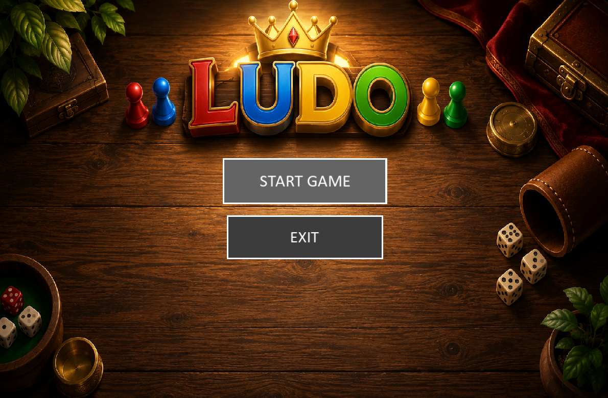
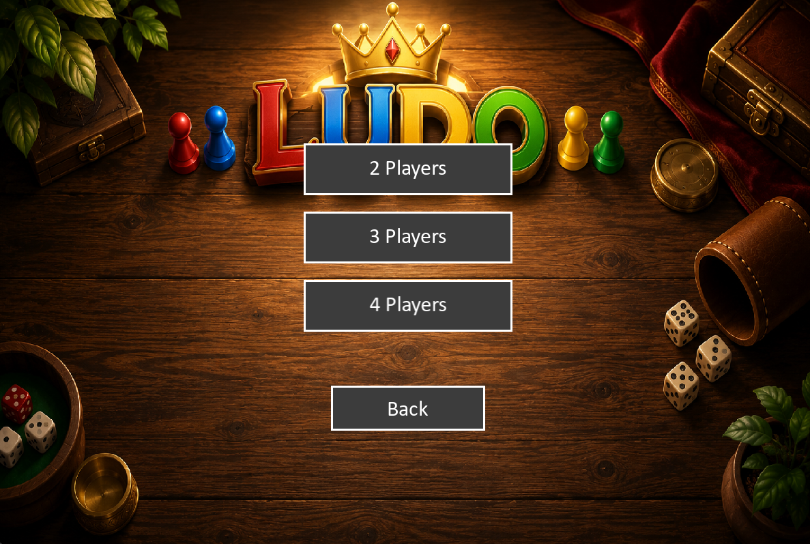
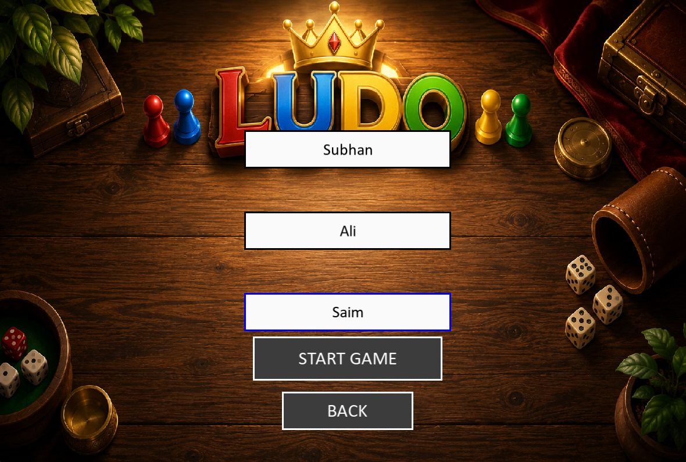
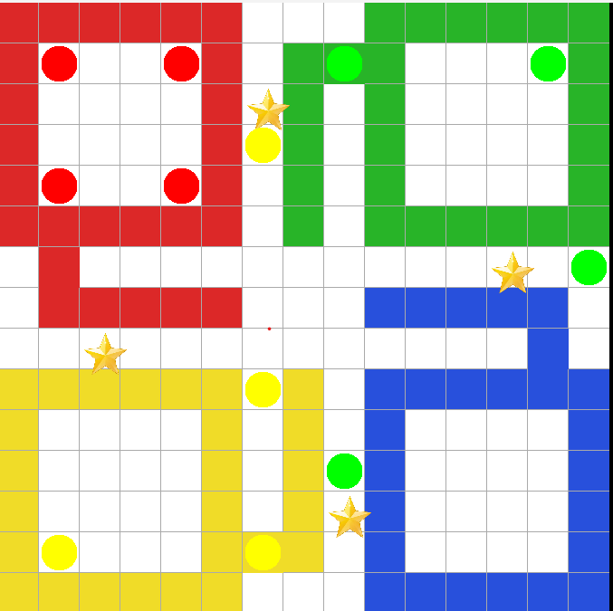

# 🎲 Ludo Game Engine (C++ | SFML)

A modern, object-oriented implementation of the classic **Ludo** board game built using **C++** and **SFML**.

The project was developed with a strong focus on **software engineering principles**, **clean architecture**, **object-oriented programming**, and **reusable game engine design**. The graphical interface is built on top of an independent game engine, making the project easy to extend with future features such as AI, networking, animations, and save/load functionality.

---

# 📸 Screenshots

## Main Menu



---

## Player Selection



---

## Player Name Input



---

## Gameplay



---

## Winner Screen


---

#  Features

##  Gameplay

- Classic Ludo gameplay
- Supports **2–4 players**
- Complete turn management
- Dice rolling
- Token movement
- Safe squares
- Home paths
- Winner detection
- Extra turn after rolling a **6**

---

##  Graphical Interface

- Modern SFML interface
- Main Menu
- Player Selection Screen
- Player Name Input Screen
- Interactive buttons
- Mouse-based token selection
- Token highlighting
- Board rendering
- Winner Screen
- Background music

---

##  Software Engineering

- Object-Oriented Design
- Modular architecture
- Encapsulation
- Separation of concerns
- Reusable Game Engine
- Independent UI layer
- Clean class hierarchy

---

# Technologies Used

- C++
- SFML 3.1
- Object-Oriented Programming
- Git
- GitHub

---

# Project Structure

```text
Ludo-Game
│
├── Assets
│   ├── Images
│   ├── Music
│   └── Sounds
│
├── src
│   ├── Board.cpp
│   ├── Button.cpp
│   ├── Dice.cpp
│   ├── Game.cpp
│   ├── Graphics.cpp
│   ├── Player.cpp
│   ├── TextBox.cpp
│   ├── Token.cpp
│   └── main.cpp
│
├── include
│   ├── Board.h
│   ├── Button.h
│   ├── Dice.h
│   ├── Game.h
│   ├── Graphics.h
│   ├── Player.h
│   ├── TextBox.h
│   └── Token.h
│
└── README.md
```

---

# Development Timeline

---

# Milestone 1 — Project Architecture

### Objectives

- Planned the overall software architecture.
- Designed a reusable game engine before implementing graphics.
- Defined responsibilities for each class.

### Completed

- Designed the `Token` class.
- Implemented token movement.
- Added support for:
  - Base Position (`-1`)
  - Start Position (`0`)
  - Home Position (`57`)
- Designed and implemented the `Player` class.
- Implemented player win detection.

### Design Decisions

- Player owns all four Token objects.
- Token manages only its own state.
- Game controls all gameplay.
- Applied clean OOP principles.

---

# Milestone 2 — Dice & Board Design

### Objectives

- Implement the Dice system.
- Design Board architecture.

### Completed

- Implemented Dice class.
- Random dice generation.
- Current dice value storage.
- Board architecture planning.

### Board Responsibilities

- Safe square detection
- Home path validation
- Board rule management
- Stateless board design

---

# Milestone 3 — Game Initialization

### Objectives

- Integrate engine components.

### Completed

- Implemented Game class.
- Player setup.
- Player color assignment.
- Name input.
- Validation for 2–4 players.

---

# Milestone 4 — Console Game Engine

### Objectives

Build a fully playable console version.

### Completed

- Main game loop
- Turn management
- Dice rolling
- Token selection
- Movable token detection
- Token movement
- Winner detection
- Extra turn after rolling a **6**
- Player switching
- Engine integration

### Result

A fully functional console-based Ludo game engine.

---

# Milestone 5 — SFML Graphical Interface

### Objectives

Convert the console engine into a graphical desktop application.

### Completed

### Interface

- Main Menu
- Player Selection
- Player Name Input
- Background music
- Interactive buttons
- Hover effects

### Gameplay

- Graphical board
- Token rendering
- Mouse-based token selection
- Movable token highlighting
- Dice rendering
- Winner screen

### Visual Improvements

- Safe-square stars
- Colored entry squares
- Improved board presentation

### Engine Integration

- Connected SFML with the console engine.
- Removed console setup from graphical mode.
- Connected player setup with the UI.
- Synced board rendering with game logic.

### Bug Fixes

- Fixed Blue/Yellow track mapping.
- Corrected token rendering.
- Fixed player initialization.
- Improved UI responsiveness.

---

# Current Status

```text
Version 1.0

 Complete Game Engine
 Complete SFML Interface
 Mouse Interaction
 Object-Oriented Architecture
 Interactive Menus
 Winner Screen
 Safe Squares
 Professional UI
```

---

# Future Improvements

- Dice rolling animation
- Token movement animation
- Capture animation
- Sound effects expansion
- Save / Load game
- AI opponent
- Online multiplayer
- Game settings
- Themes
- Statistics system

---

# How to Run

1. Clone the repository

```bash
git clone https://github.com/YOUR_USERNAME/Ludo-Game.git
```

2. Open the project in **Visual Studio**

3. Ensure **SFML 3.1** is properly configured.

4. Build the project.

5. Run.

---

# Concepts Practiced

- Object-Oriented Programming
- Classes & Objects
- Constructors
- Encapsulation
- Composition
- Game Loop
- State Management
- Event Handling
- Mouse Input
- Graphics Programming
- Software Architecture
- Clean Code
- Git Version Control

---

# Author

**Muhammad Subhan Shahid**

BS Computer Science Student

FAST – National University of Computer & Emerging Sciences

---

If you like this project, consider giving it a **Star** on GitHub.
